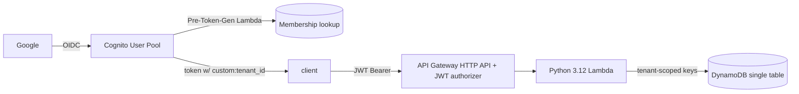
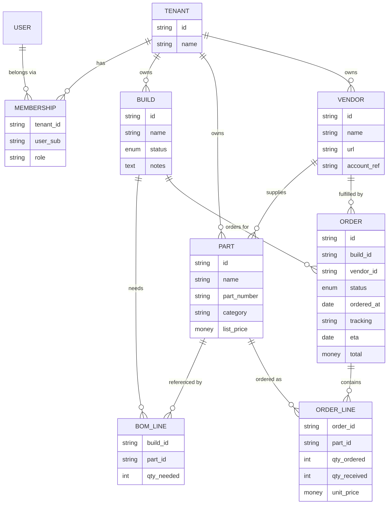

# MotorBase — Design

MotorBase is an **engine-building database** focused on **building and tracking parts ordering (procurement)**. A builder defines the parts a given engine build needs (a bill of materials), then orders those parts from vendors and tracks them through the procurement lifecycle — what's needed vs. ordered vs. received, from whom, at what cost, with tracking/ETA.

The application is designed as a **multi-tenant SaaS** from day one, running on an **AWS serverless** stack.

---

## 1. Product scope

The headline experience is a per-build **procurement dashboard**: for every part a build needs, show how many are still *to order*, *on order*, *received*, or *backordered*.

### MVP

- Parts **catalog** (reusable parts with vendor + pricing).
- **Vendors** directory.
- **Builds** and their **bill of materials** (BOM: parts needed + quantities).
- **Orders** to vendors with line items, cost, tracking, and ETA.
- **Receiving**: record received quantities against order lines.
- **Procurement dashboard** per build: computed to-order / on-order / received / backordered.
- Search/filter catalog by category and vendor; list orders by status/vendor.

### Later

- Notifications for backorders / deliveries.
- Attachments (invoices, packing slips) and per-build activity log.
- Inventory/stock tracking of received parts.
- Export order/build sheets to PDF; reorder templates.
- Full tenant switching and richer RBAC.

---

## 2. Multi-tenancy model

- **Pooled** multi-tenant: one DynamoDB table and one API/Lambda stack shared across tenants; every item is scoped by tenant.
- **Tenant id is the leading segment of every partition key** (composite, e.g. `TENANT#<t>#BUILD#<id>`), rather than a single shared `TENANT#<t>` partition. This enforces tenant isolation on every query while avoiding a hot partition and the 10 GB item-collection limit that a single per-tenant partition would eventually hit.
- The tenant id is taken **only from the validated JWT claim** (`custom:tenant_id`), never from client input, so no request can reach another tenant's data.

---

## 3. Identity: Cognito + Google federation + custom tenant claim

- **Cognito User Pool** with **Google** as a federated OIDC IdP; users sign in via the Cognito Hosted UI OAuth flow.
- Custom attribute `custom:tenant_id` (plus optional `custom:role`) on the User Pool.
- Because federated (Google) users are created on first login, tenant assignment cannot rely on a static signup attribute. A **Pre Token Generation Lambda trigger** looks up the user's tenant membership on each token issuance and injects `custom:tenant_id` (and role) into the token claims. This also supports a user belonging to multiple tenants later (choose active tenant → claim).
- Membership is stored in the table (`Tenant` + `Membership` items). Assignment strategies:
  - **Invitation-based** (default): an admin invites an email into a tenant; on first Google login the trigger resolves the pending membership.
  - **Email-domain mapping**: e.g. `@acme.com` → Acme tenant (good for single-org SSO).
- **API Gateway (HTTP API)** uses the built-in **JWT authorizer** to validate Cognito tokens; Lambda reads `sub` + `custom:tenant_id` from the authorizer context.



---

## 4. Domain model

Entities: `Tenant`, `Membership`, `User` (Cognito), `Vendor`, `Part` (catalog), `Build`, `BomLine`, `Order`, `OrderLine`.



### Procurement math (per BOM part)

- `on_order   = Σ (qty_ordered − qty_received)` across open order lines
- `received   = Σ qty_received`
- `to_order   = max(0, qty_needed − on_order − received)`

### Order status lifecycle

`DRAFT → SUBMITTED → PARTIALLY_RECEIVED → RECEIVED`, plus `BACKORDERED` and `CANCELLED`.

---

## 5. DynamoDB single-table design (tenant-scoped)

One table (`MotorBase`) with `PK`/`SK` and two GSIs. Tenant id prefixes every key and GSI.

| Entity | PK | SK |
|---|---|---|
| Tenant meta | `TENANT#<t>` | `#META` |
| Membership (user↔tenant) | `TENANT#<t>` | `USER#<sub>` |
| User's tenants (reverse lookup) | `USER#<sub>` | `TENANT#<t>` |
| Build meta | `TENANT#<t>#BUILD#<id>` | `#META` |
| Build list (per user) | `TENANT#<t>#USER#<sub>` | `BUILD#<id>` |
| BOM line | `TENANT#<t>#BUILD#<id>` | `PART#<partId>` |
| Order (per build) | `TENANT#<t>#BUILD#<id>` | `ORDER#<orderId>` |
| Order meta | `TENANT#<t>#ORDER#<id>` | `#META` |
| Order line | `TENANT#<t>#ORDER#<id>` | `LINE#<partId>` |
| Part (catalog) | `TENANT#<t>#PART#<id>` | `#META` |
| Vendor | `TENANT#<t>#VENDOR#<id>` | `#META` |

Global secondary indexes:

- **GSI1 (catalog / vendor browse)**: `GSI1PK = TENANT#<t>#CATEGORY#<cat>` / `GSI1SK = PART#<id>`; a vendor's parts via `GSI1PK = TENANT#<t>#VENDOR#<id>`.
- **GSI2 (order tracking)**: `GSI2PK = TENANT#<t>#STATUS#<status>` / `GSI2SK = ORDER#<orderedAt>`; a vendor's orders via `GSI2PK = TENANT#<t>#VENDOR#<id>`.

### Access patterns

- List my builds; get a build.
- Get a build's BOM (parts needed).
- List a build's orders; get an order and its lines.
- Browse catalog by category; list a vendor's parts.
- List open/backordered orders across builds; list a vendor's orders.
- Resolve which tenants a user belongs to (drives the token trigger).

The `USER#<sub>` reverse-lookup items are the only non-tenant-prefixed keys; they carry no business data and exist purely to resolve tenant membership for the pre-token-generation trigger.

---

## 6. AWS architecture

- **Cognito User Pool** (Google federation, `custom:tenant_id`, pre-token-gen trigger) — see §3.
- **API Gateway HTTP API** with a Cognito **JWT authorizer**.
- **Lambda (Python 3.12)** using **AWS Lambda Powertools for Python** (routing via the API Gateway resolver, plus structured logging, tracing, metrics) and `boto3` for DynamoDB. **Pydantic** models for request/response validation.
- Default packaging: **one Lambda + Powertools router** (simpler cold starts and local dev), with the option to split into per-domain functions later.
- **DynamoDB** single table with two GSIs (see §5).

### Proposed API surface

- `GET/POST /vendors`, `GET/PUT/DELETE /vendors/{id}`
- `GET/POST /parts`, `GET/PUT/DELETE /parts/{id}` (catalog)
- `GET/POST /builds`, `GET/PUT/DELETE /builds/{id}`
- `GET/PUT /builds/{id}/bom` (manage needed parts)
- `GET /builds/{id}/procurement` (computed dashboard)
- `GET/POST /orders`, `GET /orders/{id}`, `PUT /orders/{id}/status`
- `GET/PUT /orders/{id}/lines`, `POST /orders/{id}/receive` (record received qty)

All routes are authorized by the Cognito JWT authorizer and scoped to `custom:tenant_id`.

---

## 7. Isolation enforcement (defense in depth)

- **Single repository layer**: every read/write takes `tenant_id` from the request context and prepends it to keys, so handlers cannot query without it. An assertion verifies every key begins with the caller's `TENANT#<t>`.
- **Cross-tenant tests**: a tenant A token must never read/write tenant B items.
- **Optional hardening (documented next step)**: per-request scoped credentials using an IAM `dynamodb:LeadingKeys` condition (via STS session tags) so the datastore itself rejects cross-tenant access. This is more involved with a shared Lambda role, so the MVP relies on the enforced repo layer + assertions.

---

## 8. Infrastructure as code + local development

Default IaC: **AWS SAM** (Python-friendly, strong local loop). Alternative: **AWS CDK (Python)**.

Local dev/test loop (no AWS account required to build and test the API):

- `sam local start-api` runs API Gateway + Lambda locally.
- **DynamoDB Local** (Docker) hosts the table; `moto` / DynamoDB Local back unit tests.
- Cognito cannot run locally, so a **mock JWT authorizer** injects a test `sub` and `custom:tenant_id`, exercising the full tenant-scoped path. The real Cognito authorizer + pre-token-gen trigger are used on deploy.
- Tests: **pytest** for domain (procurement math) and repository logic, including cross-tenant isolation tests, plus a smoke script hitting `sam local`.

### Proposed repository layout

```
template.yaml          # SAM: API GW, Lambda, DynamoDB, Cognito (+Google IdP), triggers
src/motorbase/
  handlers/            # Powertools router + route handlers
  models/              # pydantic request/response models
  repo/                # DynamoDB single-table access + tenant-scoping assertions
  domain/              # procurement math, order lifecycle
  auth/                # claim extraction, pre-token-generation trigger
tests/                 # pytest (moto / DynamoDB Local), cross-tenant isolation
scripts/               # seed data, local run helpers
```

---

## 9. Build plan (phased)

1. Scaffold SAM app (API GW + Lambda + DynamoDB + Cognito) and the dev environment / update script.
2. Tenant-scoped single table + repository layer with isolation assertions.
3. Domain module (procurement math, order lifecycle) + unit tests.
4. Catalog CRUD (vendors, parts).
5. Builds + BOM; procurement dashboard endpoint.
6. Orders + order lines + receiving; order status transitions.
7. Cognito Google federation + pre-token-generation trigger (mock locally, real on deploy).
8. Cross-tenant isolation tests; `sam local` end-to-end smoke.
9. Later: frontend SPA, notifications, attachments, inventory, PDF export.

---

## 10. What runs locally vs. needs cloud

- **Local (no AWS account):** SAM app, DynamoDB single table + repo, Powertools router, procurement domain, seed data, `pytest` (incl. cross-tenant isolation), full API via `sam local` with a mock authorizer.
- **Cloud deploy (requires credentials):** an AWS account and a **Google OAuth client id/secret** (with Cognito callback URLs) to wire real Google sign-in through Cognito. Requested only at deploy time.

---

## 11. Open decisions (defaults in **bold**)

1. Tenant assignment: **invitation-based membership** — or email-domain mapping (or both)?
2. Multi-tenant users: **model supports it; MVP issues a claim for a single/default tenant** — or full tenant switching now?
3. IaC: **AWS SAM** — or CDK (Python)?
4. Lambda packaging: **single Lambda + Powertools router** — or one function per domain?
5. Frontend: **API-first MVP (no UI yet)** — or include a minimal React SPA with Cognito Hosted UI?
6. Units for engine specs (when spec tracking is added): **metric primary (mm/cc), imperial display toggle** — or imperial-first?
