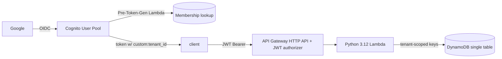
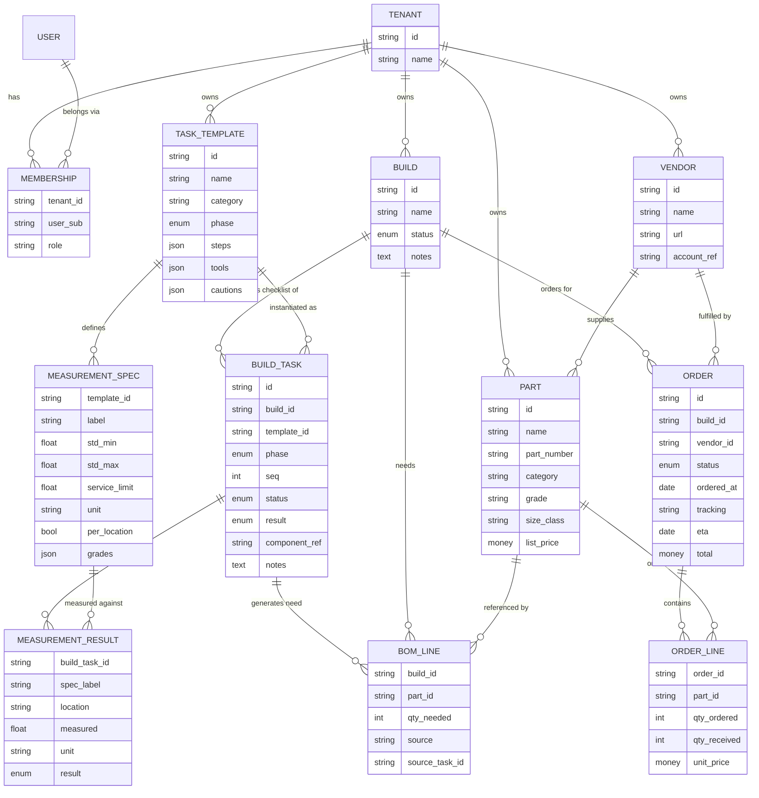

# MotorBase — Design

MotorBase is an **engine-building database** built around two connected pillars:

1. **Guided build workflow** — walk an engine builder through the common tasks of a build (evaluate the valvetrain, examine the cylinder head, examine the pistons, examine the cylinders, etc.), capturing the measurements each task requires and flagging anything out of spec.
2. **Parts ordering (procurement)** — define the parts a build needs (a bill of materials), order them from vendors, and track them through the procurement lifecycle: what's needed vs. ordered vs. received, from whom, at what cost, with tracking/ETA.

The two pillars are connected: an inspection task that fails or measures out of spec (e.g. a worn cylinder or cracked head) generates a **part need**, which flows into the BOM and the ordering workflow. This makes MotorBase a single place to both *do* the build and *supply* the build.

The application is designed as a **multi-tenant SaaS** from day one, running on an **AWS serverless** stack.

---

## 1. Product scope

Two headline experiences:

- A per-build **guided task checklist**: the builder works through inspection/assembly tasks by phase, follows step-by-step instructions, records the measurements each task requires, and sees pass / fail / out-of-spec results.
- A per-build **procurement dashboard**: for every part a build needs, show how many are still *to order*, *on order*, *received*, or *backordered*.

### MVP

Guided build workflow:

- **Task templates** (reusable procedures) covering common tasks — examine cylinders, examine pistons, examine cylinder head, evaluate valvetrain, plus crankshaft/bearings, connecting rods, and rings. Each template defines ordered steps, required tools, and the measurement specs to capture (nominal + tolerance/limits + unit).
- **Build tasks**: instantiate templates onto a build, grouped by phase (teardown → clean → inspect → machine → assemble → final), with per-task status (not started / in progress / pass / fail / skipped).
- **Measurement capture** with in-/out-of-spec flagging, including per-location measurements (e.g. per cylinder, per journal, per valve).
- **Findings → parts needs**: a failed/out-of-spec task can generate a recommended part need that feeds the BOM.

Parts ordering:

- Parts **catalog** (reusable parts with vendor + pricing) and **Vendors** directory.
- **Builds** and their **bill of materials** (BOM: parts needed + quantities), including needs generated from inspection findings.
- **Orders** to vendors with line items, cost, tracking, and ETA; **Receiving** against order lines.
- **Procurement dashboard** per build: computed to-order / on-order / received / backordered.
- Search/filter catalog by category and vendor; list orders by status/vendor.

### Later

- System-provided task template library per engine family, with tenant customization/versioning.
- Notifications for backorders / deliveries and for failed inspections.
- Attachments (task photos, invoices, packing slips) and per-build activity log.
- Inventory/stock tracking of received parts.
- Export build sheet + inspection report + order sheets to PDF; reorder templates.
- Full tenant switching and richer RBAC.

---

## 2. Multi-tenancy model

- **Pooled** multi-tenant: one DynamoDB table and one API/Lambda stack shared across tenants; every item is scoped by tenant.
- **Tenant id is the leading segment of every partition key** (composite, e.g. `TENANT#<t>#BUILD#<id>`), rather than a single shared `TENANT#<t>` partition. This enforces tenant isolation on every query while avoiding a hot partition and the 10 GB item-collection limit that a single per-tenant partition would eventually hit.
- The tenant id is taken **only from the validated JWT claim** (`custom:tenant_id`), never from client input, so no request can reach another tenant's data.

---

## 3. Identity: Cognito + Google federation + custom tenant claim

- **Cognito User Pool** with **Google** as a federated OIDC IdP; users sign in via the Cognito Hosted UI OAuth flow.
- Custom attribute `custom:tenant_id` (plus optional `custom:role`) on the User Pool.
- Because federated (Google) users are created on first login, tenant assignment cannot rely on a static signup attribute. A **Pre Token Generation Lambda trigger** looks up the user's tenant membership on each token issuance and injects `custom:tenant_id` (and role) into the token claims. This also supports a user belonging to multiple tenants later (choose active tenant → claim).
- Membership is stored in the table (`Tenant` + `Membership` items). Assignment strategies:
  - **Invitation-based** (default): an admin invites an email into a tenant; on first Google login the trigger resolves the pending membership.
  - **Email-domain mapping**: e.g. `@acme.com` → Acme tenant (good for single-org SSO).
- **API Gateway (HTTP API)** uses the built-in **JWT authorizer** to validate Cognito tokens; Lambda reads `sub` + `custom:tenant_id` from the authorizer context.



---

## 4. Domain model

Entities: `Tenant`, `Membership`, `User` (Cognito), `Vendor`, `Part` (catalog), `Build`, `BomLine`, `Order`, `OrderLine`, plus the guided-workflow entities `TaskTemplate`, `MeasurementSpec`, `BuildTask`, and `MeasurementResult`.



### Guided build workflow

- **Task templates** are reusable procedures grouped by `category` (cylinders, pistons, cylinder head, valvetrain, crankshaft/bearings, connecting rods, rings, assembly) and a build `phase` (`TEARDOWN → CLEAN → INSPECT → MACHINE → ASSEMBLE → FINAL`). A template carries ordered `steps`, required `tools`, and a set of `MeasurementSpec`s.
- A **build task** is a template instantiated onto a specific build, ordered within its phase by `seq`, with `status` (`NOT_STARTED / IN_PROGRESS / PASS / FAIL / SKIPPED`) and an overall `result`.
- **Measurement results** capture the actual reading for each spec; `per_location` specs repeat per cylinder/journal/valve (e.g. bore diameter measured on cylinders 1–8). Each result is auto-flagged against both the standard range (`std_min`/`std_max`) and the `service_limit` (in-spec / out-of-spec-but-serviceable / beyond-limit).
- **Findings feed procurement**: when a task fails or a measurement is beyond limit, MotorBase can create a `BomLine` with `source = "inspection"` and `source_task_id` referencing the task, so the required replacement part flows straight into the BOM and ordering workflow.

Example templates and the measurements they capture:

| Task template | Category / phase | Key measurements (per location) |
|---|---|---|
| Examine cylinders | cylinders / INSPECT | bore diameter, taper, out-of-round, surface finish (per cylinder) |
| Examine pistons | pistons / INSPECT | piston-to-wall clearance, ring end gap, ring-groove/side clearance, weight (per piston) |
| Examine cylinder head | cylinder head / INSPECT | deck flatness/warpage, valve-seat concentricity, valve-guide clearance, chamber cc, crack check (pass/fail) |
| Evaluate valvetrain | valvetrain / INSPECT + ASSEMBLE | valve spring installed height, seat/open pressure, valve lash, retainer-to-seal clearance, coil-bind clearance, pushrod length (per valve) |
| Crankshaft / bearings | crankshaft / ASSEMBLE | main & rod bearing clearance (plastigage), crank endplay, journal diameter (per journal) |

### Modeled on factory service manuals + selective fit

This model is validated against a real factory service manual (a Nissan "Engine Mechanical" section), whose structure maps directly onto MotorBase:

- Manual procedure (Removal / Disassembly / **Inspection** / Assembly / Installation) → **task templates** by `category` + `phase`.
- Manual **precautions** (e.g. angular/torque-to-yield tightening on head/main/rod/pulley bolts; liquid-gasket application) → template `cautions` and step notes.
- Manual **Special Service Tools** → template `tools`.
- Manual **Service Data & Specifications (SDS)** → `MeasurementSpec`s, which distinguish a *standard range* from a *wear/service limit* (hence `std_min`/`std_max` + `service_limit`), and are frequently **per-location** (per cylinder/journal) and **per-grade**.

**Selective fit / grades.** The SDS shows many parts come in graded sizes — e.g. pistons in grades 1–3 plus service oversizes, and main bearings in grades 0–4 (each with a thickness range and identification color). The correct part is *selected from a measurement* to hit a target clearance (e.g. choose a bearing grade so main-bearing clearance lands in range). MotorBase captures this by:

- `Part.grade` / `Part.size_class` (e.g. STD / 0.25 mm oversize; bearing grade + color) so a catalog part represents a specific graded variant.
- `MeasurementSpec.grades` holding the per-grade sub-ranges when a spec is graded.
- A **selection step**: an out-of-spec/graded measurement resolves to a specific graded `Part`, which becomes the `BomLine` (with `source = "inspection"`) and then the order. This is the concrete bridge between the inspection pillar and the ordering pillar.

To respect the source manual's copyright, MotorBase stores only user-entered or user-imported spec values (and ships a small set of generic example templates); it does not redistribute a manufacturer's manual.

### Procurement math (per BOM part)

- `on_order   = Σ (qty_ordered − qty_received)` across open order lines
- `received   = Σ qty_received`
- `to_order   = max(0, qty_needed − on_order − received)`

### Order status lifecycle

`DRAFT → SUBMITTED → PARTIALLY_RECEIVED → RECEIVED`, plus `BACKORDERED` and `CANCELLED`.

---

## 5. DynamoDB single-table design (tenant-scoped)

One table (`MotorBase`) with `PK`/`SK` and two GSIs. Tenant id prefixes every key and GSI.

| Entity | PK | SK |
|---|---|---|
| Tenant meta | `TENANT#<t>` | `#META` |
| Membership (user↔tenant) | `TENANT#<t>` | `USER#<sub>` |
| User's tenants (reverse lookup) | `USER#<sub>` | `TENANT#<t>` |
| Build meta | `TENANT#<t>#BUILD#<id>` | `#META` |
| Build list (per user) | `TENANT#<t>#USER#<sub>` | `BUILD#<id>` |
| BOM line | `TENANT#<t>#BUILD#<id>` | `PART#<partId>` |
| Order (per build) | `TENANT#<t>#BUILD#<id>` | `ORDER#<orderId>` |
| Order meta | `TENANT#<t>#ORDER#<id>` | `#META` |
| Order line | `TENANT#<t>#ORDER#<id>` | `LINE#<partId>` |
| Part (catalog) | `TENANT#<t>#PART#<id>` | `#META` |
| Vendor | `TENANT#<t>#VENDOR#<id>` | `#META` |
| Task template meta | `TENANT#<t>#TASKTEMPLATE#<id>` | `#META` |
| Measurement spec | `TENANT#<t>#TASKTEMPLATE#<id>` | `SPEC#<label>` |
| Build task (checklist item) | `TENANT#<t>#BUILD#<id>` | `TASK#<phase>#<seq>#<taskId>` |
| Build task meta | `TENANT#<t>#TASK#<taskId>` | `#META` |
| Measurement result | `TENANT#<t>#TASK#<taskId>` | `MEAS#<label>#<location>` |
| Task attachment | `TENANT#<t>#TASK#<taskId>` | `ATTACH#<id>` |

Global secondary indexes:

- **GSI1 (catalog / vendor / template browse)**: `GSI1PK = TENANT#<t>#CATEGORY#<cat>` / `GSI1SK = PART#<id>`; a vendor's parts via `GSI1PK = TENANT#<t>#VENDOR#<id>`; task templates by category via `GSI1PK = TENANT#<t>#TASKCATEGORY#<cat>` / `GSI1SK = TASKTEMPLATE#<id>`.
- **GSI2 (order + task tracking)**: `GSI2PK = TENANT#<t>#STATUS#<status>` / `GSI2SK = ORDER#<orderedAt>`; a vendor's orders via `GSI2PK = TENANT#<t>#VENDOR#<id>`; open tasks by status via `GSI2PK = TENANT#<t>#TASKSTATUS#<status>` / `GSI2SK = TASK#<taskId>`.

### Access patterns

- List my builds; get a build.
- Get a build's BOM (parts needed), including inspection-sourced needs.
- List a build's task checklist ordered by phase + seq; get a task with its measurement results.
- List a task template with its measurement specs; browse task templates by category.
- List a build's open/failed tasks (by status).
- List a build's orders; get an order and its lines.
- Browse catalog by category; list a vendor's parts.
- List open/backordered orders across builds; list a vendor's orders.
- Resolve which tenants a user belongs to (drives the token trigger).

The `TASK#<phase>#<seq>#<taskId>` sort key sorts a build's checklist directly in workflow order, so the guided experience is a single `Query` on `TENANT#<t>#BUILD#<id>` with an `SK begins_with "TASK#"`.

The `USER#<sub>` reverse-lookup items are the only non-tenant-prefixed keys; they carry no business data and exist purely to resolve tenant membership for the pre-token-generation trigger.

---

## 6. AWS architecture

- **Cognito User Pool** (Google federation, `custom:tenant_id`, pre-token-gen trigger) — see §3.
- **API Gateway HTTP API** with a Cognito **JWT authorizer**.
- **Lambda (Python 3.12)** using **AWS Lambda Powertools for Python** (routing via the API Gateway resolver, plus structured logging, tracing, metrics) and `boto3` for DynamoDB. **Pydantic** models for request/response validation.
- Packaging: **one Lambda function per domain** (builds/tasks, catalog, orders, engine-specs, and the Cognito auth trigger), each using Powertools. This gives clearer separation, independent scaling, and least-privilege IAM per domain (see §12).
- Units: **metric is canonical/stored** (mm, cc); the API accepts imperial entry and supports an imperial display toggle, converting to metric on store (see §12).
- **DynamoDB** single table with two GSIs (see §5).

### Proposed API surface

- `GET/POST /vendors`, `GET/PUT/DELETE /vendors/{id}`
- `GET/POST /parts`, `GET/PUT/DELETE /parts/{id}` (catalog)
- `GET/POST /task-templates`, `GET/PUT/DELETE /task-templates/{id}` (procedure library + specs)
- `GET /spec-template`, `GET /spec-template/schema` (download standardized JSON template + schema)
- `GET/POST /engine-specs`, `GET /engine-specs/{type}[/{revision}]` (upload/validate/store engine spec sets — see §11)
- `GET/POST /builds`, `GET/PUT/DELETE /builds/{id}`
- `GET /builds/{id}/tasks` (guided checklist, phase-ordered), `POST /builds/{id}/tasks` (instantiate template)
- `GET/PUT /tasks/{id}` (status/result/notes), `POST /tasks/{id}/measurements` (record readings → auto in/out-of-spec)
- `POST /tasks/{id}/needs` (turn a finding into a BOM part need)
- `GET/PUT /builds/{id}/bom` (manage needed parts)
- `GET /builds/{id}/procurement` (computed dashboard)
- `GET/POST /orders`, `GET /orders/{id}`, `PUT /orders/{id}/status`
- `GET/PUT /orders/{id}/lines`, `POST /orders/{id}/receive` (record received qty)

All routes are authorized by the Cognito JWT authorizer and scoped to `custom:tenant_id`.

---

## 7. Isolation enforcement (defense in depth)

- **Single repository layer**: every read/write takes `tenant_id` from the request context and prepends it to keys, so handlers cannot query without it. An assertion verifies every key begins with the caller's `TENANT#<t>`.
- **Cross-tenant tests**: a tenant A token must never read/write tenant B items.
- **Optional hardening (documented next step)**: per-request scoped credentials using an IAM `dynamodb:LeadingKeys` condition (via STS session tags) so the datastore itself rejects cross-tenant access. This is more involved with a shared Lambda role, so the MVP relies on the enforced repo layer + assertions.

---

## 8. Infrastructure as code + local development

Default IaC: **AWS SAM** (Python-friendly, strong local loop). Alternative: **AWS CDK (Python)**.

Local dev/test loop (no AWS account required to build and test the API):

- `sam local start-api` runs API Gateway + Lambda locally.
- **DynamoDB Local** (Docker) hosts the table; `moto` / DynamoDB Local back unit tests.
- Cognito cannot run locally, so a **mock JWT authorizer** injects a test `sub` and `custom:tenant_id`, exercising the full tenant-scoped path. The real Cognito authorizer + pre-token-gen trigger are used on deploy.
- Tests: **pytest** for domain (procurement math) and repository logic, including cross-tenant isolation tests, plus a smoke script hitting `sam local`.

### Proposed repository layout

```
template.yaml          # SAM: API GW, Lambda, DynamoDB, Cognito (+Google IdP), triggers
src/motorbase/
  handlers/            # one handler per domain (Powertools) + shared routing
  models/              # pydantic request/response models
  repo/                # DynamoDB single-table access + tenant-scoping assertions
  domain/              # procurement math, order lifecycle
  auth/                # claim extraction, pre-token-generation trigger
tests/                 # pytest (moto / DynamoDB Local), cross-tenant isolation
scripts/               # seed data, local run helpers
```

---

## 9. Build plan (phased)

1. Scaffold SAM app (API GW + Lambda + DynamoDB + Cognito) and the dev environment / update script.
2. Tenant-scoped single table + repository layer with isolation assertions.
3. Domain module (procurement math, order lifecycle, measurement in/out-of-spec evaluation) + unit tests.
4. Catalog CRUD (vendors, parts) and task-template CRUD (with measurement specs) + seed of standard templates.
5. Builds + guided task checklist (instantiate templates, phase/seq ordering, status/result).
6. Engine spec templates: serve the standardized JSON template, validate uploads against the schema, store as `EngineSpec`; measurement capture with per-location readings validated against the build's `EngineSpec` (in-spec / out-of-standard / beyond-limit).
7. Findings → BOM: turn beyond-limit measurements into part needs, resolving graded/selective-fit parts to the correct `Part.grade`; BOM management.
8. Orders + order lines + receiving; order status transitions; procurement dashboard.
9. Cognito Google federation + pre-token-generation trigger (mock locally, real on deploy).
10. Cross-tenant isolation tests; `sam local` end-to-end smoke (walk a build task → out-of-spec → need → order → receive).
11. Later: frontend SPA, notifications, attachments/photos, inventory, PDF report export.

---

## 10. What runs locally vs. needs cloud

- **Local (no AWS account):** SAM app, DynamoDB single table + repo, per-domain Powertools handlers, procurement domain, seed data, `pytest` (incl. cross-tenant isolation), full API via `sam local` with a mock authorizer.
- **Cloud deploy (requires credentials):** an AWS account and a **Google OAuth client id/secret** (with Cognito callback URLs) to wire real Google sign-in through Cognito. Requested only at deploy time.

---

## 11. Engine specification templates (download / upload)

MotorBase provides a **standardized JSON specification template**. A user downloads a blank template, fills in every measurement value for an engine type (e.g. VG33E — valve stem diameter, valve face/seat, runout, clearances, graded parts), and uploads it. The upload is validated and stored as an engine-type **specification set**, then used to validate the guided measurement workflow.

Concrete artifacts in this repo (derived from a factory-manual EM section):

- `schema/engine-spec.schema.json` — the JSON Schema (draft 2020-12) that defines/validates the standardized template.
- `schema/engine-spec.template.json` — the blank downloadable template (all measurement keys, empty values).
- `schema/examples/vg33e.engine-spec.json` — a filled VG33E example (21 sections, ~116 measurements: cylinder head, camshaft, valve, valve guide/seat/spring, lifter, rocker, block, piston, rings, pin, rod, crank, bearings, compression pressure, compression ratio + volumes, valve timing, misc).
- `scripts/make_blank_template.py` — derives the blank template from a filled spec (the same way the download link is generated server-side).
- `scripts/spec_eval.py` — reference evaluator that classifies a reading as `IN_SPEC` / `OUT_OF_STANDARD` / `BEYOND_LIMIT`, or resolves the matching grade for selective-fit parts.
- `scripts/compression_ratio.py` — reference math for the `compression_ratio` section (swept/deck/gasket/clearance volumes and the static ratio), verified against the reference article.

### Format

Top level is `{ specVersion, engine, sections[] }`. Each `section` groups `measurements[]` by component; each measurement carries `key`, `label`, `unit`, optional `appliesTo` (intake/exhaust/outer/inner), `perLocation` + `locations` (per cylinder/journal/valve), a `standard` range, a `service`/wear `limit`, `nominal` (single-target specs like valve clearance 0), and `grades[]` for graded/selective-fit parts (piston grades, bearing grades with ID color, oversizes/undersizes). Computed values use `derived: true` plus a `formula` string that references other measurement keys. This directly models the SDS distinction between a standard/new range and a wear limit, plus per-location, per-grade, and derived values.

### Compression ratio and volumes

The `compression_ratio` section captures the static (initial) compression ratio and every volume used to compute it, following the standard engine-builder method:

- `compression_ratio = (swept_volume + clearance_volume) / clearance_volume`
- `swept_volume = 0.7854 * bore^2 * stroke / 1000` (per cylinder, mm to cc)
- `clearance_volume = combustion_chamber_volume + piston_dome_dish_volume + ringland_crevice_volume + deck_volume + head_gasket_volume`
- `deck_volume = 0.7854 * bore^2 * deck_clearance / 1000`, `head_gasket_volume = 0.7854 * head_gasket_bore^2 * head_gasket_compressed_thickness / 1000`

Measured inputs (chamber and piston dome/dish are cc'd with a burette; deck clearance, block deck height, gasket bore/thickness, compression height are measured) drive the derived volumes and ratio. `scripts/compression_ratio.py` implements this and is verified against the reference article (a 632 c.i. big-block at 15.92:1) and a VG33E build-up.

### Storage (`EngineSpec` entity)

The uploaded document is stored **whole** as a tenant-scoped item, versioned by revision:

| Entity | PK | SK |
|---|---|---|
| Engine spec (revision) | `TENANT#<t>#ENGINESPEC#<engineType>` | `REV#<revision>` |
| Engine spec (latest pointer) | `TENANT#<t>#ENGINESPEC#<engineType>` | `#LATEST` |

Browse by manufacturer/family via GSI1 (`GSI1PK = TENANT#<t>#ENGINEMFR#<mfr>`). Documents are small (a few KB) and fit well within a DynamoDB item; if a spec ever exceeds limits it is offloaded to S3 with a pointer stored on the item.

### Endpoints

- `GET /spec-template` — download the blank standardized template (JSON).
- `GET /spec-template/schema` — the JSON Schema.
- `POST /engine-specs` — upload a filled template; validated against the schema, then stored as an `EngineSpec` (new revision + `#LATEST`).
- `GET /engine-specs`, `GET /engine-specs/{type}`, `GET /engine-specs/{type}/{revision}`.

### How it validates the workflow

A build references an engine type + `EngineSpec` revision. When a `BuildTask` records a `MeasurementResult` for a `spec_key`, MotorBase resolves that key in the build's `EngineSpec` and classifies the reading (in-spec / out-of-standard / beyond-limit) — and for graded specs, returns the selected grade so the correct graded part flows into the BOM (see §7 selective fit). The `EngineSpec` is the authoritative source of numbers; task templates only reference `spec_key`s and describe procedure.

## 12. Decisions

### Resolved

1. **Valvetrain** — "valve frame" means the valvetrain (valves, springs, retainers, guides, rockers/pushrods).
2. **Tenant assignment: invitation-based membership** — an admin invites an email into a tenant; the pre-token-generation trigger resolves the pending membership on first Google login.
3. **Multi-tenant users: single/default tenant for MVP** — the data model supports multiple memberships, but the token issues a claim for one default tenant now; full tenant switching is deferred.
4. **IaC: AWS SAM.**
5. **Lambda packaging: one function per domain** (builds/tasks, catalog, orders, engine-specs, auth trigger), each using AWS Lambda Powertools. Trades a little more infra for clearer separation, independent scaling, and least-privilege IAM per domain.
6. **Units: metric is the canonical/stored unit** (mm, cc), since the engines worked on are specified in metric. Because many engine-builder tools report in imperial, the app accepts **imperial entry** and offers an **imperial display toggle**, converting to metric on store. The spec files already carry both (e.g. `0.1 mm (0.004 in)`).

### Still open (defaults in **bold**)

7. Task templates: **tenant-owned copies seeded from a standard library (fully customizable, tenant-isolated)** — or a shared read-only `SYSTEM#` template catalog?
8. Frontend: **API-first MVP (no UI yet)** — or include a minimal React SPA with Cognito Hosted UI?
9. Graded/selective-fit parts: **model grades on `Part` + per-grade spec sub-ranges now, with measurement-driven part selection** — or defer grading to a later phase?
10. Spec seeding: **ship a few generic example task templates; let tenants enter/import their own manufacturer specs (no redistribution of copyrighted manuals)** — or build a per-engine template library later?
